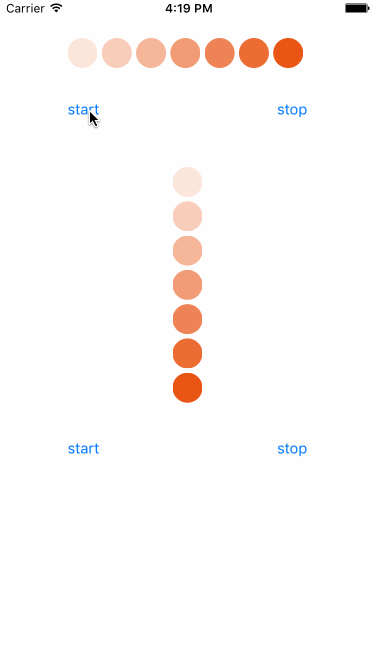

# WDLoadingView
一个跳动的加载等待View

## **效果**

<p align="left" >
  
</p>

##简单易用
控件比较小，不需要什么pod管理，直接将View拖入工程即可

##代码

##初始化

```objc 
	self.loadview1 = [[WDLoadingView alloc] initWithFrame:self.view1.bounds circleCount:7];
    [self.view1 addSubview:self.loadview1];
```

###开始loading

```objc 
	[self.loadview1 startAnimation];
```

###结束loading

```objc 
	[self.loadview1 stopAnimation];
```


